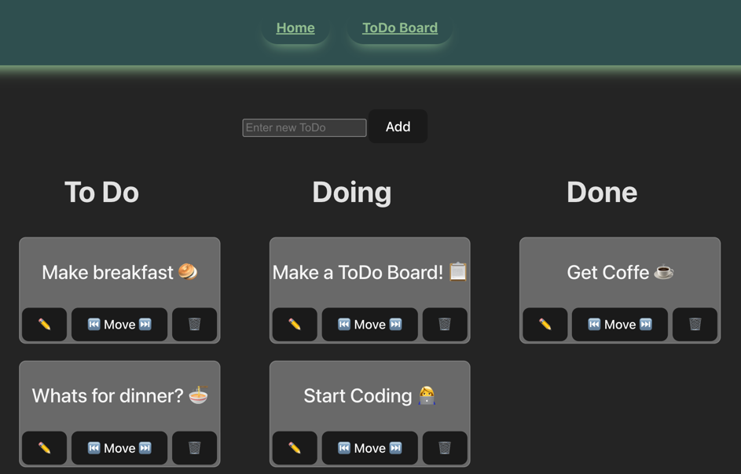

# 🧩 ToDo App — Frontend Implementation



This project is a simple but complete **ToDo management app** 
built with **React + TypeScript** on the frontend and a **Spring 
Boot REST API** on the backend.
In my [previous project](https://github.com/nina-bornemann/ToDo_Backend_Project), the **frontend** was provided and I 
built the **backend**.  
This time, the challenge was reversed - the **backend** was 
given, and I implemented the **frontend** from scratch.

The goal: to create a fully functional, clean, and responsive user interface that interacts with the existing REST API.

This is a work in progress (see Future Implementations ⬇️)


---

## 🚀 Features

- Fetch all ToDos from the backend and display them by status:
    - 🟢 **To Do**
    - 🟡 **In Progress**
    - 🔵 **Done**
- **Create** new ToDos in the input field
- **Edit** descriptions inline
- **Change** ToDo status via dropdown
- **Delete** ToDos directly from the list
- Real-time updates without page reloads
- Error handling for failed requests

---

## 🛠️ Tech Stack

**Frontend:**
- React (with hooks)
- TypeScript
- Axios (for HTTP requests)
- CSS / basic styling

**Backend (given):**
- Java Spring Boot
- REST API (with endpoints for GET, POST, PUT)

---

## 📸 API Endpoints

| Method   | Endpoint | Description                               |
|----------|-----------|-------------------------------------------|
| `GET`    | `/api/todo` | Fetch all ToDos                           |
| `POST`   | `/api/todo` | Create a new ToDo                         |
| `PUT`    | `/api/todo/{id}` | Update existing ToDo (description/status) |
| `DELETE` | `/api/todo/{id}` | Delete a ToDo from List                   |

**Example ToDo object:**
```json
{
  "id": "a12b3c",
  "description": "Finish React project",
  "status": "IN_PROGRESS"
}     
```

## 🧪 How to Run

Clone the repo
> git clone

Install dependencies
>npm install


Start the frontend
>npm run dev


Start the backend (in a separate terminal)
>./mvnw spring-boot:run


Visit 👉 http://localhost:5173

## 🧹 Future Improvements

- Improve UI/UX (animations, transitions, responsive design)
- Add toast notifications for success/error
- Unit tests for components
- Drag-and-drop ToDo rearranging
